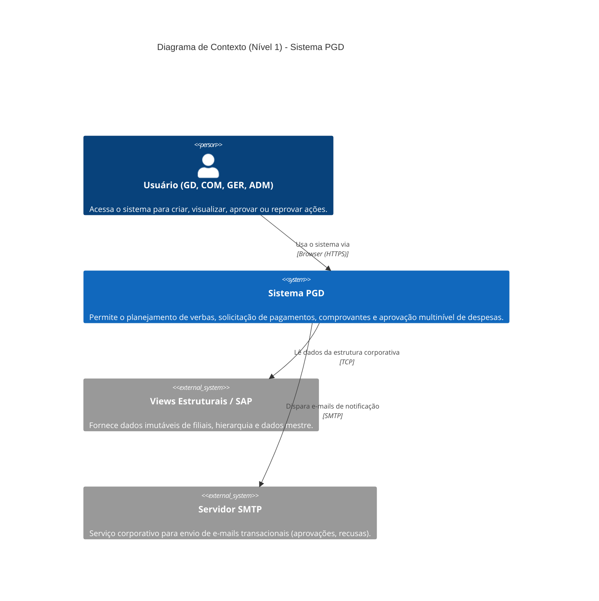
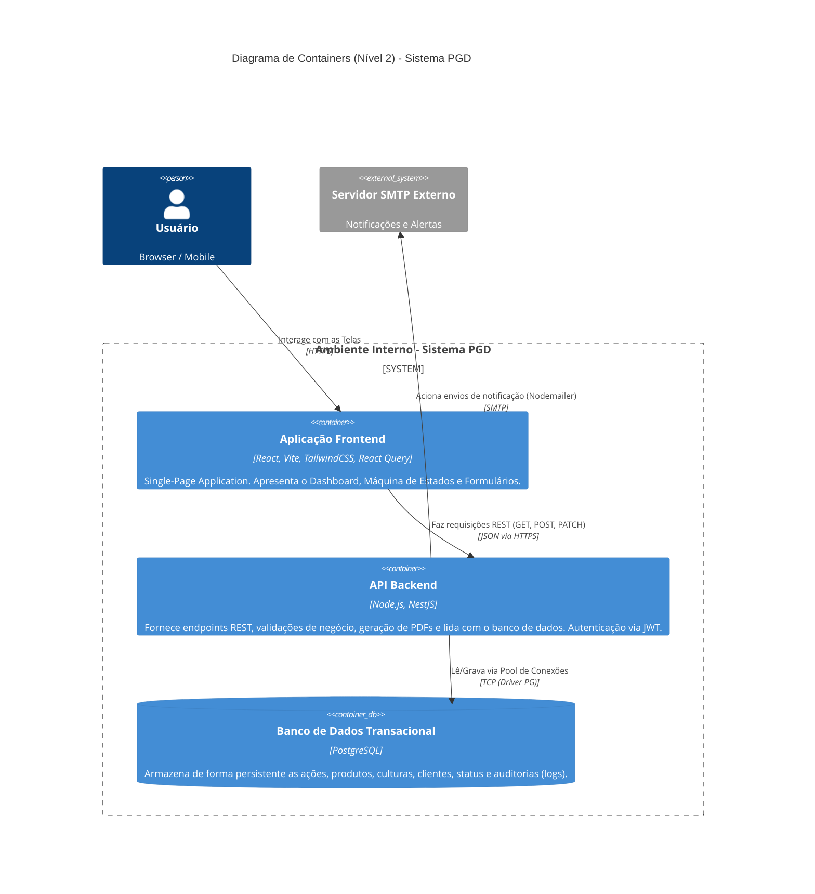

# Arquitetura do Sistema - PGD (Planejamento e Gestão de Despesas)

Este documento descreve a arquitetura macro do sistema PGD utilizando a notação [C4 Model](https://c4model.com/).
A arquitetura foi projetada para suportar alta disponibilidade, clara separação de responsabilidades (Frontend desacoplado) e forte segurança com validação de Tokens JWT.

## Nível 1: Diagrama de Contexto (System Context)

O diagrama de contexto mostra como o Sistema PGD se encaixa no ambiente corporativo, quem são os usuários que o utilizam, e com quais sistemas externos ele se comunica para exercer sua função completa.

---

## Nível 2: Diagrama de Containers (Containers)

No nível 2, "damos um zoom" dentro do Sistema PGD (a caixa azul do diagrama acima) para entender como ele é construído internamente. Ele é baseado na clássica arquitetura de Três Camadas (SPA + API + Banco).

## Detalhamento Técnico

1. **Frontend (Aplicação React):**
   - Roteamento feito via `react-router-dom`.
   - Gerenciamento de chamadas assíncronas e cache inteligente via `@tanstack/react-query`.
   - Estilização funcional com `Tailwind CSS`.
   
2. **Backend (API NestJS):**
   - Construída de forma modular (`ActionsModule`, `DatabaseModule`, `AuthModule`).
   - Validação forte na entrada utilizando `class-validator` com DTOs.
   - Banco de dados sem ORM pesado, utilizando consultas SQL parametrizadas nativas para máxima performance em relatórios (Query Builder).
   - Documentação de rotas automatizada pelo Plugin nativo do Swagger (disponível na rota `/api/docs`).

3. **Autenticação:**
   - Baseado em `Passport JWT`. Apenas usuários com token válido contendo assinatura digital no Header HTTP são capazes de consumir a API e realizar transações.
